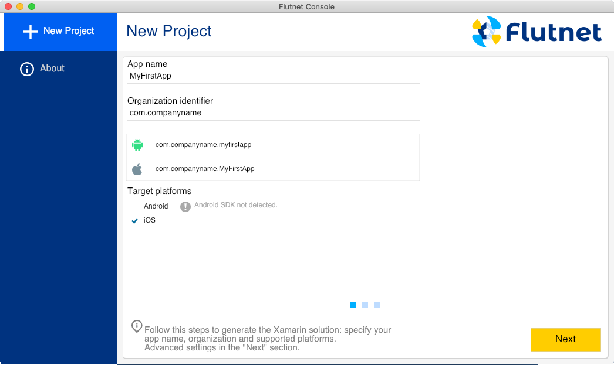
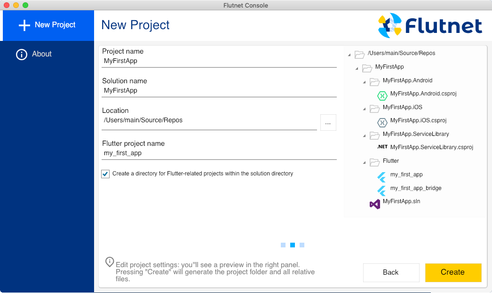
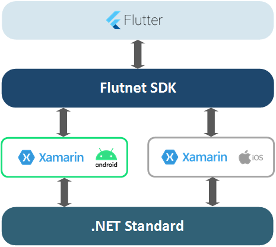
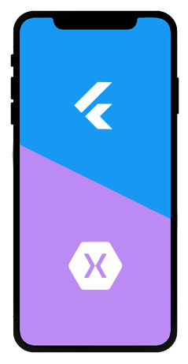

# Flutnet SDK

[](https://www.gnu.org/licenses/lgpl-3.0)

This repository holds the **Flutnet Console** - the official graphical tool that allows you to  generate Flutnet projects - and the underlying **Flutnet CLI** - the command-line interface that hosts all the main logic both for project creation and Dart code generation.

These tools depend on:
- [Flutnet Xamarin Bindings](https://github.com/flutnet/flutnet_xamarin-libs)
- [Flutnet Runtime Libraries](https://github.com/flutnet/flutnet_xamarin-libs)

<div style="background-color:white; padding:0%; margin-bottom: 3%;">


</div>

## What is Flutnet?

Flutnet is a set of tools and libraries that allows you to create rich and beautiful Xamarin apps using [Flutter](https://flutter.dev/) as UI Layer and .NET as backend. For more details please visit https://www.flutnet.com/.

<div style="background-color:white; padding:0%; margin-bottom: 3%;">


</div>

## Setup requirements

The ***Flutnet Console*** is a `.NET Core 3.1` project, that use [Avalonia](https://avaloniaui.net/) as a Cross-Platform XAML framework for NET. 

If you like to apply some UI change on the Console we advice to install the [Avalonia IDE extension](https://avaloniaui.net/docs/quickstart/ide-support): this extension allow a design-time UI preview on the IDE, but **_it's NOT REQUIRED for building the project_**.

>See [.NET Tutorial - Hello World in 10 minutes](https://dotnet.microsoft.com/learn/dotnet/hello-world-tutorial/intro)

## Build the project (Windows and macOS) :hammer:

In this section will provide a detailed procedure ini order to build the project. We'll refer to all the bash scripts `*.sh` commands. 
> Windows user need to replace all the commands using the corrisponding `*.cmd`

### Restore all NuGet Packages

This command allow to  restore all the required nuget packages for the projects.

```sh
scripts/restore-nuget-packages.sh
```

### Build and publish the client (`flutnet` command line tool)

The first thing is to build the `Flutnet.Cli` project containing the `flutnet` command line tool.

To build run
```sh
scripts/build-cli.sh
```

and to publish run

```sh
scripts/publish-cli.sh
```


### Build and publish the Flutnet Console (`FlutnetUI` project)


To build run
```sh
scripts/build-ui.sh
```

and to publish run

```sh
scripts/publish-ui.sh
```

If everithing have worked fine, you'll find all the compiled objects inside the `artifacts/` forder, for both `osx-x64` and `win-x64`:
- Flutnet.Cli
- FlutnetUI


### Run the Flutnet Console

Depending on your System you need to double click:
- `artifacts/win-x64/FlutnetUI/FlutnetUI.exe` for Windows
- `artifacts/osx-x64/FlutnetUI/FlutnetUI` for macOS


## Contributing

Pull requests are welcome. For major changes, please open an issue first to discuss what you would like to change.

## License

This project is licensed under the LPGL v3 license (https://www.gnu.org/licenses/lgpl-3.0.html)