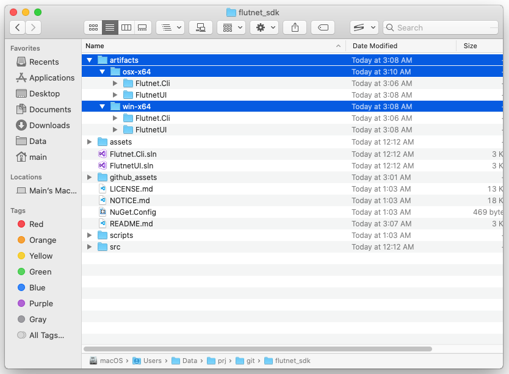

# Flutnet SDK

[](https://www.gnu.org/licenses/lgpl-3.0)

This repository holds the **Flutnet Console** - the official graphical tool that allows you to  generate Flutnet projects - and the underlying **Flutnet CLI** - the command-line interface that hosts all the main logic both for project creation and Dart code generation.

These tools depend on:
- [Flutnet Xamarin Bindings](https://github.com/flutnet/flutnet_xamarin-libs)
- [Flutnet Runtime Libraries](https://github.com/flutnet/flutnet_xamarin-libs)

<div style="background-color:white; padding:0%; margin-bottom: 3%;">


</div>

  - [What is Flutnet?](#what-is-flutnet)
  - [System requirements](#system-requirements)
  - [Building procedure](#building-procedure)
  - [Notes on publishing](#notes-on-publishing)
  - [Contributing](#contributing)
  - [License](#license)

## What is Flutnet?

Flutnet is a set of tools and libraries that allows you to create rich and beautiful Xamarin apps using [Flutter](https://flutter.dev/) as UI Layer and .NET as backend. For more details please visit https://www.flutnet.com/.

<div style="background-color:white; padding:0%; margin-bottom: 3%;">


</div>

## System requirements

Both **Flutnet Console** and **Flutnet CLI** target .NET Core 3.1, so `.NET Core 3.1 SDK` is the only real requirement for building these projects. 

However, **Flutnet Console** is a [Avalonia](https://avaloniaui.net/) MVVM Application: if you need full IDE support for code inspection and XAML design/preview, you have to use JetBrains Rider IDE or install [Avalonia for Visual Studio extension](https://marketplace.visualstudio.com/items?itemName=AvaloniaTeam.AvaloniaforVisualStudio).

## Building procedure

To build the source porjects, just run the following scripts:

**macOS**
```sh
scripts/build-cli.sh
scripts/build-ui.sh
```

**Windows**
```sh
scripts/build-cli.cmd
scripts/build-ui.cmd
```

These will build all the projects within the `FlutnetUI.sln` (Flutnet Console) and `Flutnet.Cli.sln` solutions, restoring all the required NuGet packages.

Once the scripts have completed, you can open both solutions in your IDE and start debugging.

## Notes on publishing

This repository contains a couple of convenient scripts for publishing the source projects:

**macOS**
```sh
scripts/publish-cli.sh
scripts/publish-ui.sh
```

**Windows**
```sh
scripts/publish-cli.cmd
scripts/publish-ui.cmd
```

These scripts just prepare the applications for release on both macOS and Windows. The resulting set of files is published to `artifacts/` directory.



**HOWEVER**, you must be aware that the published executables are NOT ready to run _as-is_ because they look for dependency files and folders (such as templates for project creation) in a way that strictly depends on the installation procedure defined within the official Flutnet SDK.  

## Contributing

Pull requests are welcome. For major changes, please open an issue first to discuss what you would like to change.

## License

This project is licensed under the LPGL v3 license (https://www.gnu.org/licenses/lgpl-3.0.html)